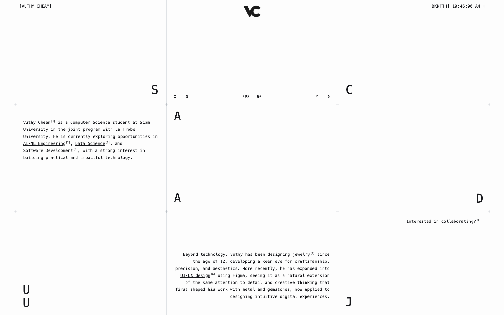
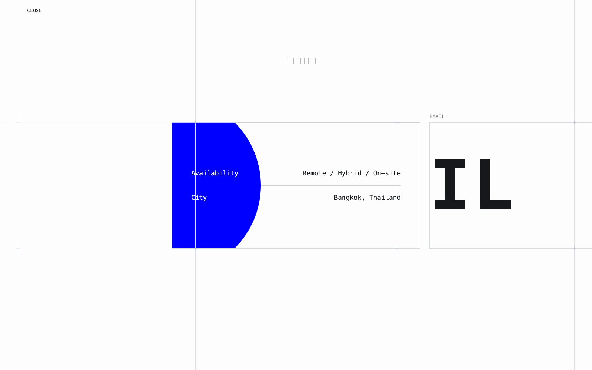

# Portfolio — [vuthycheam.com](https://vuthycheam.com)

Personal portfolio site of **Vuthy Cheam** — Computer Science student at Siam University,
in the joint program with La Trobe University.

## About

A hand-written static site with no framework, no bundler, and no build step — just HTML,
CSS, and vanilla JavaScript served directly from this repository.

The design is built on a fixed modular grid: thin rules at 3%, 33%, 67%, and 97% with plus
marks at every intersection. Content is positioned against that grid rather than centred in
a container, and the motion work is written to respect it — panels come to rest on grid
lines, boxes align to cell edges, and transitions hand off from one page's grid to the
next. Type is monospaced throughout, with a restrained palette of off-white, near-black,
and a single accent.

## Features

**Page transitions** — clicking an internal link pulls two vertical lines inward until they
meet, wiping the page blank; the destination pushes them back out. Each page owns where its
lines rest: the home page has a grid, so they settle onto it at 3% / 97%, while other pages
have nothing to rest on and settle at the page edges. A trip out of home therefore starts
on the grid and ends at the edges, and the trip back does the reverse.

**Contact page intro** — the row of contact boxes assembles from a single dot. It comes
apart into a vertical column of eight, and on the way apart each one is simultaneously
squaring off into a rectangle and lifting its black to reveal its own colour — separation,
shape, and colour all driven by one progress value. The resolved column then unrolls into
the horizontal row while zooming the rest of the way in.

**Scroll-driven contact rail** — the boxes scroll horizontally and respond to swipes in any
direction. They shrink as you scroll away from centre, and each carries its own artwork
keyed to its distance from the middle: `EMAIL` slides so only `IL` or `EM` shows at either
extreme, the LinkedIn letters separate, the X glyph scales, and the info circle drifts.

**Preloader** — a counter and progress line on first load, skipped automatically when you
arrive through a page transition so in-session navigation stays seamless.

**Details** — click-to-copy email, live Bangkok time badge, cursor position and frame-rate
HUD, custom macOS-style cursors, and mobile visitors redirected to a desktop-only notice
(with search-engine and link-preview crawlers explicitly exempted so the site still indexes).

**Reduced motion** — every animated system checks `prefers-reduced-motion` and falls back to
the settled state.

## Tech Stack

| | |
|---|---|
| **Markup** | HTML5 |
| **Styling** | CSS3 — custom properties, flexbox, transforms, keyframe animation. No preprocessor. |
| **Behaviour** | Vanilla JavaScript, organised as independent IIFEs that each guard on the elements they need |
| **Physics** | [Matter.js](https://brm.io/matter-js/) 0.19 via CDN, for the physics-driven sections |
| **Type** | Google Fonts — Space Grotesk, Press Start 2P, Silkscreen, VT323, Jersey 10, Boogaloo, Noto Sans Khmer / Thai |
| **Hosting** | GitHub Pages with a custom domain |
| **Tooling** | None — no build, no dependencies, no package installs |

## Project Structure

```
portfolio/
├── src/
│   ├── css/style.css        all styling for the site
│   ├── js/main.js           all behaviour — loader, transitions, contact page
│   ├── work/                individual work pages
│   └── sections/            sections lifted out of index.html, kept for later reuse
├── assets/
│   ├── icons/               favicons, logos, custom cursors
│   ├── images/              photography and project imagery
│   └── videos/              background and project video
├── docs/                    working notes and screenshots
├── index.html               home
├── contact.html             contact
├── desktop-only.html        shown to mobile visitors
├── CNAME                    custom domain for GitHub Pages
├── robots.txt
├── sitemap.xml
├── package.json
├── README.md
└── .gitignore
```

The served pages stay at the repository root because GitHub Pages publishes from the root
of the branch — moving `index.html` would take the site down.

## Installation

There is nothing to install. The site is plain files, so any static server will do:

```bash
git clone https://github.com/Creyvc/portfolio.git
cd portfolio
npm run dev          # or: python3 -m http.server 8000
```

Then open <http://localhost:8000>.

`package.json` declares no dependencies — `npm install` is unnecessary, and the `dev` script
is just a convenience wrapper around Python's built-in server. Opening `index.html` directly
from the filesystem mostly works too, though a server is preferable so relative paths and
fonts resolve exactly as they do in production.

## Screenshots

**Home**



**Contact**



## Deployment

Pushing to `main` publishes the site. GitHub Pages serves the repository root, and `CNAME`
points it at `vuthycheam.com`.

---

## Notice

This repository is published as part of my professional portfolio to demonstrate my skills
and experience.

The project was developed with the assistance of AI tools and reflects my implementation,
customization, integration, testing, and deployment.

© 2026 Vuthy Cheam. All rights reserved.

No license is granted for copying, modifying, redistributing, or using this source code
without prior written permission.

> There is intentionally **no `LICENSE` file** in this repository. Its absence is not an
> oversight — under default copyright law, all rights are reserved.
